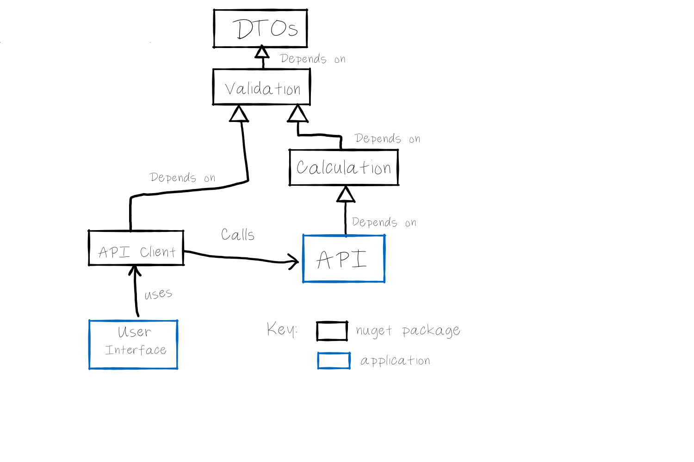

# Validation

## What is Validation?

Answers the question

`Can I use this data as input to this operation`

Validation is not just a property of the data, it depends on what you want to do with it
 - e.g. a model may be "valid" if you want to save it to a file, but not if you want to run and energy calculation

## Why validate
### Simpler code
When you know your input data is valid, you can concentrate on writing your algorithm. 
The code is easier to write and to follow.

### User feedback
If the user has entered invalid data, we should let them know as soon as possible. This reduces
wasted work and improves their mental model of the system

## Levels of validation
### Syntax and data types
Can the data be parsed correctly? Are we trying to pass a string where the code expects a number?

If you're using standard serialisation formats (e.g. JSON) and a strongly typed language (e.g. C#)
then you will get these checks for free.

### <a name="field-validation">Field validation</a>
Basic validation on an individual field. For example:
 - Number must be positive
 - Angle must be in the range 0 - 360
 - String must match a regular expression

These rules can often be added using annotations, or by using a schema - e.g. XSD or JSON Schema

These rules are invariant - it doesn't matter how the data is being used

### Model validation
Does the data make sense in the context of the entire model **and the operation you want to carry out**? 

e.g. If your turbine spacing is too small it won't stop you saving the workbook, but it will prevent you running certain calculations.

## When to validate
Inputs must be validated before running an operation.

- For an API, all inputs must be validated because they are coming in via JSON and we don't know what the source is. You cannot force clients to validate the inputs before calling the API.

- For a user-interface, inputs should be validated as soon as possible, in order to give the user quick feedback.

So, if your UI calls and API then the inputs will be validated twice. This isn't a problem if your validation is quick. And if your
validation isn't quick, **that's** your problem. 

If the calculation is running on the same machine as the UI, then you only need to validate once.

## Sharing validation code
Since the validation code needs to run in different places, it should be shared via a NuGet package. You are probably already sharing DTOs in a package. 
The validation code can be added to the same package, or a separate package that depends on the DTO package.

## Relationship with UI validation
Traditionally, we have highlighted validation errors in the UI by putting a red border around a property.

Calculation input validation operates on DTOs. These classes may not have the same structure as the model classes used in the 
user interface. Therefore, it might not be possible to map a calculation validation error back to a specific property in the UI.

We could choose to only use property highlighting for [field validation](#field-validation). 
Model validation errors could be displayed as text in a separate area.